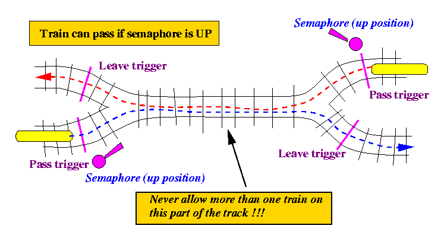

# Semaphore(신호기)
- **Semaphore** 는 IPC의 방법이 아니라, **동기화 방법** 의 하나이다.
- 세마포어는 에츠허르 다익스트라 가 제안한 **교착 상태(Dead lock)** 에 대한 해법으로 두 개의 **Atomic한 함수** 로 제어되는 **정수 변수** 로 멀티프로그래밍 환경에서 공유자원에 대한 접근 제어를 하는 방식이다.
- 세마포어를 이용하면 1개의 공유되는 자원에 제한된 개수의 프로세스, 또는 스레드만 접근할 수 있도록 한다.
- 다만, 해당 방법은 모든 교착 상태에 대한 해답을 제시해 줄 수 없다.
- 하지만, 교착 상태 해법에 대한 고전적인 해법으로 아직도 대다수의 운영체제 과목 및 시스템 프로그래밍 과목에서 언급되는 개념이다.
- 이 방법으로 해결되는 대표적인 문제가 식사하는 철학자 문제 이다.
- 참고로, **Mutex**란, **Semaphore** 값이 1인 것을 칭한다.
  - 이는, **Mutual Exclusion** 알고리즘에 기반한다.
  - **Mutex** 는 **임계영역** 을 만드는데 초점이 맞춰져 있다.
  - 원래 명칭은 **Mutual Exclusive Binary Semaphore** 이다.

### 세마포어 사용 흐름
- 세마포어의 설정한 후, 임계영역에 동시에 진입할 수 있는 프로세스의 개수를 지정한다.
  - 예를 들어 Mutex를 만들고 싶다면 1로 설정한다.
  - 임계영역이 시작되는 지점에서 **down operation** 을 통해서, 임계영역을 지나는 프로세스 이외에는 다른 프로세스가 지나가지 못하도록 설정한다.
  - 임계영역을 지나가는 프로세스가 아닌 프로세스는 임계영역이 시작되는 지점에서 Blocking된 상태로, 실행 흐름을 멈추고 기다린다.
  - 임계영역을 지나간 프로세스는 영역을 지난 후 **up operation** 을 통해 다른 프로세스가 임계영역을 지나갈 수 있도록 설정한다.
  - 

### 임계영역
- 두 개의 프로세스가 하나의 파일에 동시에 접근하면 문제가 생긴다.
- **정해진 개수의 프로세스만 접근해야 하는 코드 영역** 을 **임계영역(Critical Section)** 이라 한다.

### 세마포어 사용하기
- 다음은 세마포어에서 사용하는 함수들의 목록이다.
  - `semget()`
  - `semctl()`
  - `semop()`

### semget()
- `int semget(key_t key, int nsems, int semflg);`
- 세마포어 배열을 할당한다.
- 리턴
  - 성공시 **세마포어 배열의 ID**
  - 실패시 errno 설정후 -1
- 인자
  - `key` : 세마포어 배열에 접근하기 위한 키.
  - `nsems` : 필요한 세마포어의 개수. 세마포어 배열 당 최대 세마포어 개수 이하이어야 한다.
  - `semflg` :
    - `IPC_CREAT` 사용시 세마포어 배열이 없으면 새로 생성.
    - `IPC_CREAT | IPC_EXCL` 사용시 해당 세마포어 배열이 있으면 에러.

### semctl()
- `int semctl(int semid, int semnum, int cmd, ...);`
- 세마포어를 제어하는 함수.
- 리턴
  - 성공시 `cmd` 에 따라 리턴값 다르다.
  - 실패시 errno 설정후 -1 리턴.
- 인자
  - `semid` : 세마 포어 **배열의 아이디**.
  - `semnum` : **세마 포어 배열내의 세마포어 번호.**
  - `cmd`
    - 세마포어 삭제시 : `IPC_RMID`
    - 세마포어 설정시 : `SETVAL`, `union semun`변수 설정후 인자로 넘김.

- 다음은 세마포어 설정시, 같이 넘겨야 하는 구조체의 프로토타입이다.
```c
    union semun{
      int val;                  // 임계영역을 지날 수 있는 프로세스의 개수.
      struct semid_ds *buf;
      unsigned short *array;
      struct seminfo *__buf;
    }
```

- 다음은

- 다음은 세마포어를 설정하는 프로그램(`semctl`) 코드의 일 부분이다.
```c
    // 세마 포어 설정 코드.
    if(strcmp(argv[1], "SETVAL") == 0) {
      union semun su;
      su.val = 1; // 세마포어의 개수를 1개로 설정해 놓았다.
      ret = semctl(id_sem, 0, SETVAL, su);
      if(ret == -1) {
        printf("[%d] error: %s (%d)\n", pid, strerror(errno), __LINE__);
        return EXIT_FAILURE;
      }
      printf("[%d] SETVAL OK\n", pid);
    }

    // 세마포어 삭제 코드
    else if(strcmp(argv[1], "IPC_RMID") == 0) {
      ret = semctl(id_sem, 0, IPC_RMID);
      if(ret == -1) {
        printf("[%d] error: %s (%d)\n", pid, strerror(errno), __LINE__);
        return EXIT_FAILURE;
      }
      printf("[%d] IPC_RMID OK\n", pid);
    }
```


### semop()
- `int semop(int semid, struct sembuf *sops, unsigned nsops);`
- 세마포어 배열 내 세마포어들의 동작을 제어하는 함수.
- 리턴
  - 성공시 0
  - 실패시 errno 설정후 -1 리턴.
- 인자
  - `semid` : 세마 포어 **배열의 아이디**.
  - `sops` : `struct sembuf`가 요소로 들어가 있는 배열의 내의 요소 시작 주소.
  - `nsops`
    - `sops` 부터 시작되는 배열요소의 개수.

- semop를 사용하기 위해서는 반드시 `struct sembuf` 변수를 설정해줘야 한다.
- 다음은 `sembuf`의 구조체 프로토타입이다.
  - `sem_num`은 세마포어 배열의 요소 번호를 적는다.
  - `sem_op`는 operation의 행위를 지정한다. -1(down) 혹은 1(up)
  - `sem_flg`는 일반적으로 `SEM_UNDO`를 사용한다.
    - 이렇게 설정하면, 프로세스 종료시 반납하지 못한 세마포어를 자동 반납한다.
    
```c
    struct sembuf{
      unsigned short sem_num;
      short          sem_op;
      short          sem_flg;
    }
```

- 다음은 세마포어를 제어하는 함수를 보여주는 코드 예시이다.
```c

		sb.sem_num = 0;
		sb.sem_op = -1; // down operation
		sb.sem_flg = SEM_UNDO; //
		ret = semop(id_sem, &sb, 1); // down operation
        // ===================== Critical Secion ===========================
		if(ret == -1) {
			printf("[%d] error: %s (%d)\n", pid, strerror(errno), __LINE__);
			return EXIT_FAILURE;
		}

        // File Access ....

		if(c1 != c2) {
			printf("[%d] error: not same (%d)\n", pid,  __LINE__);
			return EXIT_FAILURE;
		}
		sb.sem_num = 0;
		sb.sem_op = 1;
		sb.sem_flg = SEM_UNDO;
		    // ====================== Critical Section ======================
		ret = semop(id_sem, &sb, 1); // up operation
```

- [세마포어 예제](./system/EX03-08_sem/rw.c)
  - 위 예제를 돌리기 전에 **반드시** 세마포어 설정을 해야 한다.
  - 세마 포어 설정은 [이곳](./system/EX03-08_sem/semctl.c)을 참조한다.
  - 실행 명령
    - `./semctl SETVAL`
    - `./semctl IPC_RMID`


### Atomic Operation
- 원자화된 연산.
- 일반적으로 시스템 메모리에 있는 공유 변수를 증/감 시키기 위해서는 보통 한개의 명령으로 처리 되지 않고
`load from memory` - `inc/dec` - `store to memory` 과정을 거치면서 여러개의 명령이 순차적으로 수행된다.
- 이러한 방법을 보장하는 방법을 **Atomic Operation** 이라고 한다.
- **시스템에서 사용할 수 있는 가장 작은 단위의 동기화 기법이다.**
- 임계영역을 보호하는 각종 **lock** 을 사용하지 않고 이 연산을 사용하는 이유는 **dead-lock(교착상태)** 가 없고
동기화 기법 중 가장 빠른 성능을 가지고 있기 때문이다. **(참고로 데이터베이스의 트랜잭션과 유사하다.)**
- [참고](https://zsdotkr.github.io/programming/2017/09/21/atomic-operation.html)
